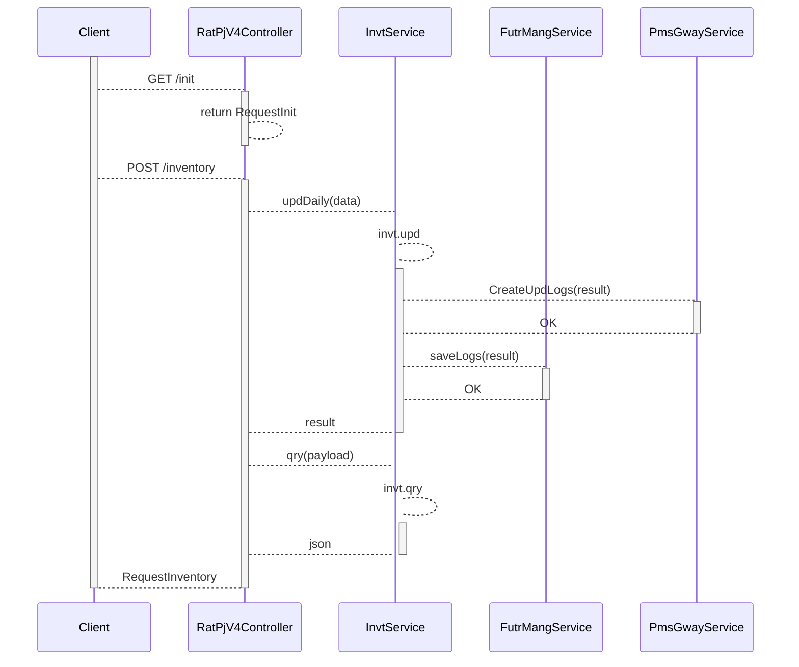

# HelloAustin
Java Practices

```mermaid
sequenceDiagram
    participant Client
    participant RatPjV4Controller
    participant InvtService
    participant FutrMangService
    participant PmsGwayService

    activate Client
    Client --> RatPjV4Controller: GET /init
    activate RatPjV4Controller
    RatPjV4Controller --> RatPjV4Controller: return RequestInit
    deactivate RatPjV4Controller

    Client --> RatPjV4Controller: POST /inventory
    activate RatPjV4Controller
    RatPjV4Controller --> InvtService: updDaily(data)
    activate InvtService
    InvtService --> InvtService: invt.upd
    activate InvtService
    InvtService --> PmsGwayService: CreateUpdLogs(result)
    activate PmsGwayService
    PmsGwayService --> InvtService: OK
    deactivate PmsGwayService
    InvtService --> FutrMangService: saveLogs(result)
    activate FutrMangService
    FutrMangService --> InvtService: OK
    deactivate FutrMangService
    InvtService --> RatPjV4Controller: result
    deactivate InvtService
    RatPjV4Controller --> InvtService: qry(payload)
    activate InvtService
    InvtService --> InvtService: invt.qry
    activate InvtService
    InvtService --> RatPjV4Controller: json
    deactivate InvtService
    RatPjV4Controller --> Client: RequestInventory
    deactivate RatPjV4Controller
    deactivate Client
```
